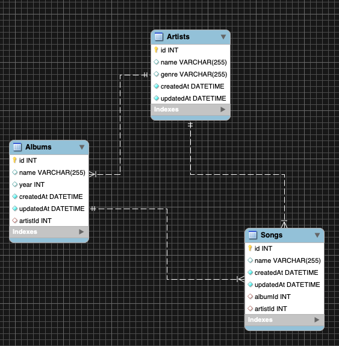

# Music Library API - Project Overview

A RESTful API which takes incoming HTTP requests and performs various CRUD operations on a MySQL database based on these incoming requests. The database contains artist records, which in turn can have albums attached to them, and these albums have songs attached to them.

A simple diagram outlining the various relationships and schema of the database can be seen below:

The database has been deloyed on Heroku and can be accessed with various URL routes. Please feel free to try out the various routes through Heroku or Postman. All of the routes can be found in app.js however I have also linked to a couple below to give an idea of how the data is displayed.

https://musiclibraryapi.herokuapp.com/artists

https://musiclibraryapi.herokuapp.com/albums

As you can see from the albums link above, there are in-built relationships between each table as albums "belong" to given artists and have the corresponding artist ID displayed on their records.

## Running the project locally

To run the project locally you will need a local installation of SQL (we achieved this by pulling a MySQL image through docker and running the database inside this container).

Once you have done this, the app will run on port 4000 by using the command "npm start". If you would like to run the tests you can do so via the command "npm test".

## Technologies and Languages Used

- MySQL and MySQL Workbench
- Docker (Used to run the MySQL database on localhost)
- GitHub
- Express
- Sequelize
- Mocha, Chai and SuperTest
- Dotenv
- Postman
- Heroku
- Node
- Javascript
- SQL

# Acknowledgements

Thanks to Manchester Codes for the guidance throughout the project.

# Author

Scott Hannabuss
